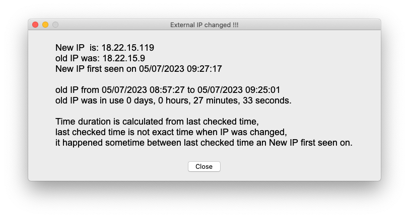

# ip_change_alert
Detect changes in your external IP address and alert you via GUI(tkinter) popup.

Also store history of IP addresses changes in file `log_ip.txt`.

# Operating system support
Write in Python, so it is cross platform and no external dependencies. 

# Usage

## Run
Best is to run it every minute via crontab, or some other scheduler. 

```
* * * * * cd ~/ip_change_alert/; ./venv_3-11-4/bin/python main.py >> ./LOGS/`date -u +\%Y-\%m-\%d`.txt 2>&1

# Delete old logs, for my use-case once per day it is fine
05 13 * * * find ~/ip_change_alert/LOGS  \( -type f -mtime +1 \) -delete
```

# Internals

## Database
Data is stored in JSON file `data.json` in same directory as `main.py`.

## Motivation
Need to noticed when my external IP is changed, so had to build tool myself.  
Can be useful for security minded individuals.
